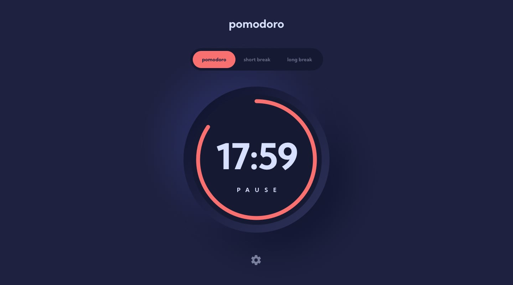

<h1 >Pomorodo App ⌚</h1>

  <h3>
    <a href="https://pomorodo-app.vercel.app/" color="white" style="color: #70f3f8">
      Live
    </a>
     | 
    <a href="https://github.com/devllopeadam/pomorodo-app" style="color: #70f3f8">
      Solution
    </a>
  </h3>

## Screeenshots 📷

## About The Project

If you're wanting to test your JavaScript skills this is the challenge for you. Use whichever JS framework you prefer and pull data from the REST Countries API.
Users should be able to:

1. Set a Pomodoro timer and short & long break timers
2. Customize how long each timer runs for
3. See a circular progress bar that updates every minute and represents how far through their timer they are
4. Customize the appearance of the app with the ability to set preferences for colors and fonts

## Built with

- Semantic HTML5 markup
- CSS custom properties
- Flex
- react JS
- vite
- sass
